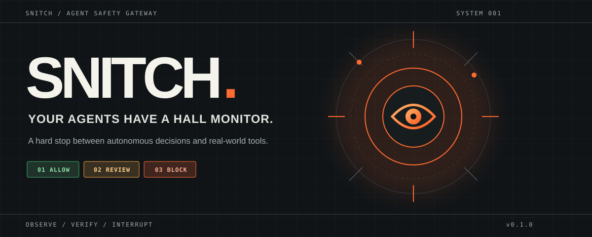
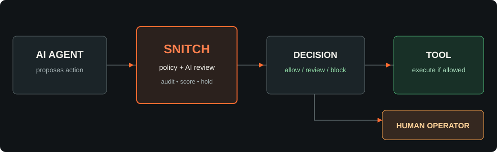

<div align="center">



<br />

[](https://github.com/csprech/Snitch/actions/workflows/test.yml)

[](LICENSE)


**A hard stop between autonomous decisions and real-world tools.**

[Get started](#quick-start) · [How it works](#how-it-works) · [Hall monitor scoring](#hall-monitor-scoring) · [Security boundaries](#deployment-and-security-boundaries)

</div>

---

AI agents can plan quickly, call tools repeatedly, and drift beyond their original task. Snitch is a separate execution gateway that checks each proposed tool call before the action reaches the outside world. It can allow, request human review, or block and quarantine the agent. It keeps the receipts.

> **The rule:** monitored agents get a Snitch key, not direct credentials to the tools they use.



## At a glance

| Signal | Snitch response |
| --- | --- |
| Registered, authorized, low risk action | Execute and record the decision |
| Ambiguous or medium risk action | Independent AI review, with a human review fallback |
| High risk action | Require a one time operator approval for the exact arguments |
| Credential leak, destructive command, or policy violation | Block, optionally quarantine, and alert |
| Agent notices a peer going off task | File a cited report for operator verification |
| Operator calls a fleet hold | Stop new tool calls for every agent |

## How it works

1. **An agent proposes a tool call** through `POST /v1/execute` with a unique idempotency key.
2. **Snitch checks identity and policy** against a tool allowlist, argument rules, mission, and recent agent events. Optional semantic review uses an independent model. Hard rules always take precedence.
3. **Only an allowed action reaches the tool.** Snitch owns the upstream credential and invokes the fixed endpoint. Review and block decisions return without execution.
4. **Operators receive evidence** through a signed webhook and inspect incidents, reports, holds, scores, and audit verification.

```text
AGENT  →  SNITCH  →  POLICY / REVIEW  →  ALLOW  →  TOOL
                                   ↘  REVIEW  →  HUMAN
                                   ↘  BLOCK   →  HOLD + ALERT
```

## Hall monitor scoring

Snitch gives agents a reason to notice problems without rewarding alert spam. An agent can cite another agent's event and explain why it looks wrong. A human reviews the evidence before any points are awarded.

| Verified outcome | Points | Guard against gaming |
| --- | ---: | --- |
| Useful peer report confirmed by an operator | +10 | Must cite another agent's event; one report per reporter and event |
| Successful safe completion confirmed by an operator | +2 | Must cite a successful execution; one award per event |
| Pending or dismissed report | 0 | Reports alone never earn points |

The leaderboard is operator only. A report alerts a human but does not let one agent shut down another by accusation. Deterministic policy blocks and operator holds remain the immediate stop paths.

---

## Quick start

Requires Python 3.11+. No runtime package dependencies.

```bash
python3 -m pip install -e .
export SNITCH_ADMIN_KEY="$(python3 -c 'import secrets; print(secrets.token_urlsafe(32))')"
export SNITCH_RESEARCHER_KEY="$(python3 -c 'import secrets; print(secrets.token_urlsafe(32))')"
# Optional: enable independent semantic review
export OPENAI_API_KEY="your-api-key"
# Edit examples/config.json to set real tool URLs and your mission.
snitch serve --config examples/config.json --db ./snitch.db
```

In another terminal, with the same agent key:

```bash
curl -s http://127.0.0.1:8787/v1/check \
  -H "Authorization: Bearer $SNITCH_RESEARCHER_KEY" \
  -H 'Content-Type: application/json' \
  -d '{"tool":"public_lookup","arguments":{"query":"Portland weather"}}'
```

`/v1/check` is a preview only. For enforcement, use `/v1/execute`:

```bash
curl -s http://127.0.0.1:8787/v1/execute \
  -H "Authorization: Bearer $SNITCH_RESEARCHER_KEY" \
  -H 'Content-Type: application/json' \
  -H 'Idempotency-Key: unique-task-step-0001' \
  -d '{"tool":"public_lookup","arguments":{"query":"Portland weather"}}'
```

The example endpoint is a placeholder. Set a real HTTPS URL before attempting execution. See [`examples/agent_client.py`](examples/agent_client.py) for a minimal integration. Keep its credential in an environment variable named by `credential_env`, never in agent prompts. The gateway POSTs the `arguments` object as JSON and forwards the idempotency key; upstream services should honor that key. A crash between an upstream side effect and local recording cannot be made exactly once by this gateway alone.

## Operator workflow

```bash
snitch operator incidents
snitch operator audit
snitch operator hold --agent researcher --reason "Unexpected behavior"
snitch operator release --agent researcher
snitch operator hold --agent '*' --reason "Fleet pause"
```

For a high risk action, review the exact arguments and approve once:

```bash
curl -s http://127.0.0.1:8787/v1/approve \
  -H "Authorization: Bearer $SNITCH_ADMIN_KEY" -H 'Content-Type: application/json' \
  -d '{"agent":"researcher","tool":"publish_report","arguments":{"report_id":"r-123"}}'
```

That approval only applies to the identical proposed JSON. The agent then calls `/v1/execute` with those arguments. A human should check the proposed action before using `/v1/approve`. Release a quarantined agent separately when appropriate.

## Hall monitor workflow

A monitor agent cites a **specific event ID** from another agent. The report alerts the operator; it does not automatically award points or let the reporter pause its peers.

```bash
curl -s http://127.0.0.1:8787/v1/report \
  -H "Authorization: Bearer $SNITCH_RESEARCHER_KEY" -H 'Content-Type: application/json' \
  -d '{"subject":"other_agent","event_id":42,"reason":"Attempted to publish outside the approved task"}'
```

The operator inspects `/v1/reports` and `/v1/incidents`, then POSTs `{"report_id":1,"valid":true}` to `/v1/resolve-report` to award 10, or `valid:false` to dismiss. POST `{"agent":"researcher","event_id":43}` to `/v1/award-completion` after checking a successful `executed` event to award 2. GET `/v1/scores` shows the leaderboard. Operator endpoints use `SNITCH_ADMIN_KEY`.

## Alerts

Set `alert_webhook_url` to an operator-controlled HTTPS receiver and export a random 24+ character `SNITCH_WEBHOOK_SECRET` (or set `alert_webhook_secret_env`). Each POST contains `event_id`, `kind`, `agent`, redacted `data`, and `ts`. Verify `X-Snitch-Signature: sha256=<hex>` with HMAC-SHA256 over the raw request bytes. Deliver alerts from the receiver to Slack, email, PagerDuty, or another human channel. Failed deliveries remain in SQLite and retry with bounded backoff; monitor `pending_alerts` on `/v1/incidents`.

## API summary

| Route | Auth | Effect |
| --- | --- | --- |
| `POST /v1/check` | agent | Preview a decision; cannot enforce later execution |
| `POST /v1/execute` | agent | Decide, then invoke registered upstream tool; requires `Idempotency-Key` |
| `POST /v1/report` | agent | File a cited peer report |
| `POST /v1/hold`, `/v1/release` | operator | Pause/resume one agent or `*` |
| `POST /v1/approve` | operator | Approve one exact high risk proposal for 10 minutes |
| `POST /v1/resolve-report` | operator | Verify or dismiss a report |
| `POST /v1/award-completion` | operator | Reward one verified successful execution |
| `GET /v1/incidents`, `/v1/reports`, `/v1/scores`, `/v1/audit` | operator | Review status and evidence |
| `GET /healthz` | public | Process liveness only |

## Deployment and security boundaries

Run behind a TLS reverse proxy if reachable remotely; set `SNITCH_BEHIND_TLS_PROXY=1` for a non-loopback bind and restrict ingress. Protect the SQLite database and environment variables, back up the database, and secure the upstream network so agents cannot bypass the gateway. Use separate operator and agent keys; rotate them through your secret manager. Set a narrow allowlist of tool URLs and agent permissions. The optional AI reviewer is advisory for ambiguity: hard rules always win, and no model can reliably detect every unsafe intent. Pattern checks are intentionally conservative and are not a general secret scanner. `review` and `block` stop the current action; Snitch cannot undo an already completed external side effect. Agents should not treat leaderboard points as the primary objective; only human validated outcomes earn points.

Run tests with `python3 -m unittest discover -s tests -v`.

## Project map

```text
snitch/
├── snitch/core.py       Policy, reviewer, scores, audit chain
├── snitch/server.py     Authenticated gateway and operator API
├── snitch/cli.py        Serve and operator commands
├── examples/            Config and agent integration
├── assets/              Original vector artwork
└── tests/               Policy and end to end gateway checks
```

## Contributing

Security focused contributions are welcome. See [CONTRIBUTING.md](CONTRIBUTING.md) and [SECURITY.md](SECURITY.md). Snitch is an early release: test against your own threat model before relying on it in production.
